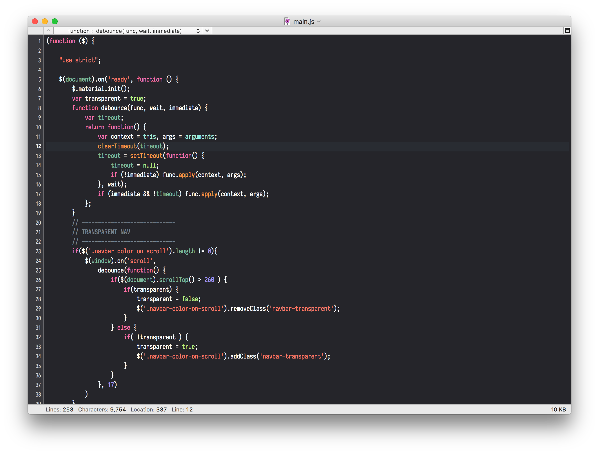
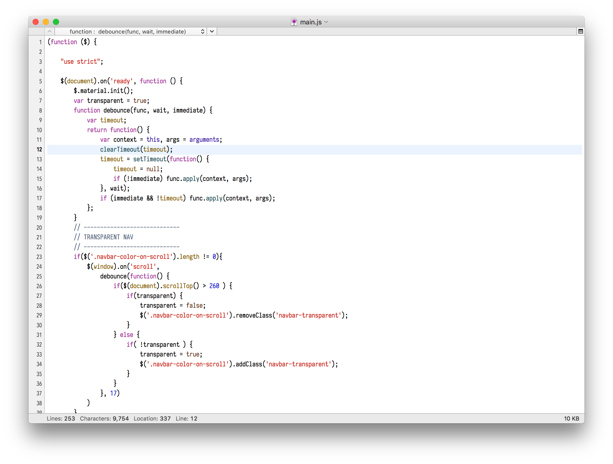

# XCode Theme for [CotEditor](https://coteditor.com)

> XCode Highlight syntax theme for great CotEditor

## Info

I just make a new cottheme file for **cotEditor | Native Editor for macOS** and I want to share it
Excat color code same as new XCode but for some programming languages you will see some differents from these to Apple XCode

Go to repo and wiki to download themes

## Screenshots

##### Dark

##### Light

## Download

Cilck [Here](https://github.com/coteditor/CotEditor/)

Then Wiki tab and enjoy

## How to install

1. Start CotEditor
2. Go to `Preferences -> Appearance`
3. Click the gear icon and then select `Import...`
4. Find and select the `Dracula.cottheme` file and click `Import`
5. Click the `XCode (Dark) or XCode (Light)` theme to apply it
6. Enjoy the CotEditor 🎉

## Author & Credits

CotEditor Developers

Jarvis Mercer (This Theme)

## License

[MIT License](./LICENSE)

#### Thanks
